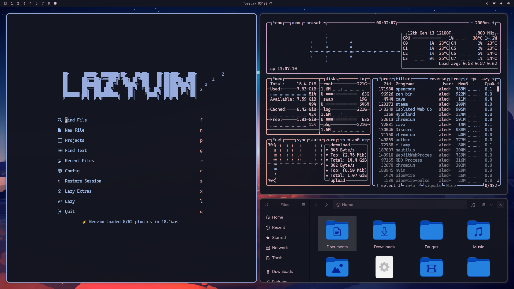

# Skyblue Theme
Dusty roses meet cool blues in this serene [Omarchy](https://omarchy.org) theme.

## Quick Install
To install this theme, use the `omarchy-theme-install` command:
```bash
omarchy-theme-install https://github.com/aledx18/omarchy-skyblue-theme
```



